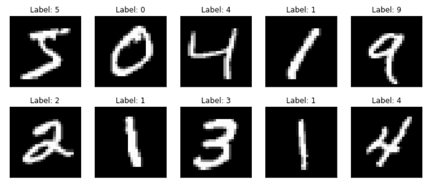
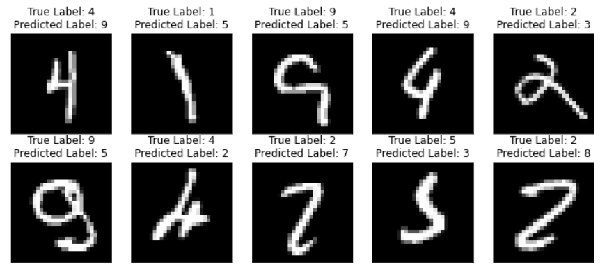

# MNIST Handwritten Digit Recognition

This project uses a Multilayer Perceptron (MLP) neural network to recognize handwritten digits from the MNIST dataset.

## Data Sources:
MNIST digits recognition dataset is one of the most widely used datasets in machine learning. It contains 60,000 training samples and 10,000 test samples. You can check out the details of the MNIST dataset from the original website http://yann.lecun.com/exdb/mnist/ .

We will use function fetch_openml from Scikit-learn library for downloading the MNIST dataset. Scikit-learn is the most popular machine learning library for python. The library contains almost all of popular machine learning techniques as well as utility functions. You can learn more about Scikit-learn from its website https://scikit-learn.org . To use MNIST dataset, you can do the following:

from sklearn.datasets import fetch_openml

X, y = fetch_openml('mnist_784', data_home='./', return_X_y=True)

X = X / 255.

X contains the feature vectors of all samples and y contains all the labels. It may take a while to run the code since it will download the data from the internet. Note that we divide X by 255 to scale the input data into the range of 0 to 1 for better numerical stability (the original data is pixel intensities, hence between 0 and 255). You should play around with these data. 

My code also shows how to read the.gz file provided on the MNIST website and train and test on this data.

## Results:
The accuracy of the model is 97.46%
#### Correct Sample Output:
 
#### Wrong Sample Output:

